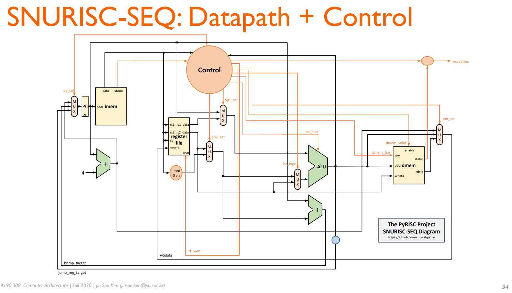
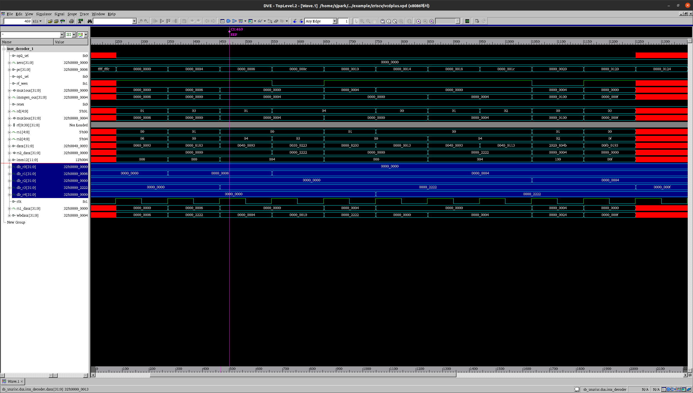

## A. RISC-V Core Design

-----
## B. Simulation Result
### Program
      addi t1, zero, 8
      lw t3,0(t1)
      addi t1, zero, 4
      sw t3,4(t0)
      lw t4,0(t1)
      nop
      addi t1,zero,4
      addi t2,zero,4
      beq t1,t2,256
    
    256:
      addi t3,zero,0xf

-----
### Result

------

## Reference

[Computer Architecture (Fall 2020)](http://csl.snu.ac.kr/courses/4190.308/2020-2/)
